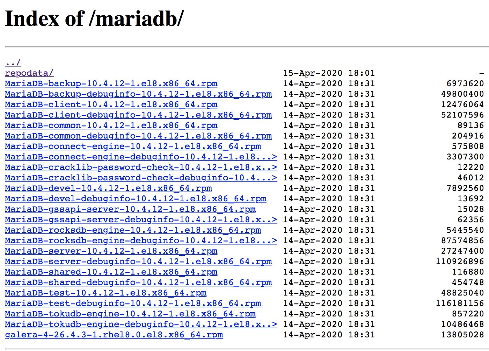

# local-yum-mariadb
Local YUM Repository including MariaDB

In this example I will set up a local YUM repository in an AWS instance and use it to Install/Configure MariaDB.

## Launch the Instance

In the AWS console I will select the Red Hat Enterprise Linux 8 64-bit, t2.micro (Free tier eligible) instance. 

Additional Configuration:
* Under the _Add Tags_ tab with create (i.e., Add Tag) the _Name_, _MariaDB_ key/value pair.
* Under the _Configure Security Group_ tab we will add the _HTTP_ (or _HTTPS_ if configuring SSL) rule.

Once configured, we will _Launch_ the instance selecting an existing _key pair_ certificated I created earlier.

## Connect to and Set up the Instance

Once the instance is up an running (as verified in the AWS console) we are ready to now connect through an SSH-enabled terminal to your instance by running the command:

```
ssh -i /<path-to-pem>/<mycert>.pem ec2-user@ec2-xxx-xxx-xxx-xxx.compute-1.amazonaws.com
```

The Public DNS above can be obtained from the instance _Description_ (and it will change every time the instance is re-started). I will from here on generically reference it using 'xxx' for each 8-bit field.

Create and configure your user id by running the following commands (_passwd_ set optional) and log in using your user:

```
sudo su
useradd <your_user>
passwd <your_user>
mkdir /home/<your_user>/.ssh
cp /home/ec2-user/.ssh/authorized_keys /home/<your_user>/.ssh/
chown -R <your_user>.<your_user> /home/<your_user>/.ssh
```

Grant _root_ access to your user by running as root the _visudo_ command and adding the line below the _ec2-user_ line:
```
<your_user>        ALL=(ALL)       NOPASSWD: ALL
```

## Set Up NGINX

Run the following commands as root user (last to verify that is is up an running):

```
yum install nginx
systemctl start nginx
systemctl enable nginx
systemctl status nginx
```

You can now verify that it is running by typing your instance public DNS in the browser (i.e., http://ec2-xxx-xxx-xxx-xxx.compute-1.amazonaws.com/) and verifying that you get the "Welcome to nginx on Red Hat Enterprise Linux!" page (if it fails to start, the _journalctl -xe_ command, as indicated in the output can help troubleshoot the cause)

## Create the Local YUM/DNF Repository

While I have used _yum_ for this installation, as of RHEL 8 it is being replaced by the _dnf_ installer (either one can be used). Run the following commands as _root_ user to support the YUM repository creation:

```
yum install createrepo  yum-utils
mkdir -p /var/www/html/repos/mariadb
```

and edit a newly created _/etc/yum.repos.d/mariadb.repo_ file to include the following:

```
[mariadb]
name=mariadb
baseurl=file:///var/www/html/repos/mariadb
enabled=1
gpgkey=file:///etc/pki/rpm-gpg/RPM-GPG-KEY-MariaDB
gpgcheck=1
```

The _gpgcheck_ can be disable initially but, if you want to set this up as I did, you can run the below commands as _root_:

```
cd /etc/pki/rpm-gpg
wget https://yum.mariadb.org/RPM-GPG-KEY-MariaDB
```


## Configure NGINX to Include the Repository

Edit the newly created _/etc/nginx/conf.d/repos.conf_ to include the following (this configuration should automatically be imported by the _/etc/nginx/nginx.conf_ main configuration file):

```
server {
        listen   80;
        server_name  ec2-xxx-xxx-xxx-xxx.compute-1.amazonaws.com; #change to your real domain
        root   /var/www/html/repos;
        location / {
                autoindex on;   #enable listing of directory index
        }
}
```


## Download the RPMS and Create the Repo

Run the following commands as _root_ to download the specific version 10.4.12 MariaDB (and non-MariaDB) rpms compatible with RHEL-8 (last _rm_ includes any non-rpm files):

```
cd /var/www/html/repos/mariadb/
yum install wget
wget -r --no-parent --no-directories --accept-regex 'MariaDB.*10.4.12.*.rpm' http://mariadb.mirror.globo.tech//mariadb-10.4.12/yum/rhel8-amd64/rpms/
wget -r --no-parent --no-directories --reject-regex 'MariaDB.*.rpm' http://mariadb.mirror.globo.tech//mariadb-10.4.12/yum/rhel8-amd64/rpms/
rm index.html
createrepo .
```

Note: If you add RPMS to the repository you can run _yum clean all_ followed _createrepo --update /var/www/html/repos/mariadb_


## Setup File Listing and Restart NGINX

Run the below commands (first one will enable the directory files listing/access):
```
restorecon -R /var/www/html/repos
service restart nginx
```

Visiting our url http://ec2-xxx-xxx-xxx-xxx.compute-1.amazonaws.com/ will now show the _mariadb_ index. Clicking on the _/mariadb_ folder will display the list of rpms as shown below.



## Test Accessing the Repo Locally

As _root_ user (or sudo) run _yum list | grep MariaDB_ to get a listing like below:

```
MariaDB-backup.x86_64                                10.4.12-1.el8                                     mariadb                         
MariaDB-backup-debuginfo.x86_64                      10.4.12-1.el8                                     mariadb                         
MariaDB-client.x86_64                                10.4.12-1.el8                                     mariadb                         
MariaDB-client-debuginfo.x86_64                      10.4.12-1.el8                                     mariadb                         
MariaDB-common.x86_64                                10.4.12-1.el8                                     mariadb                         
MariaDB-common-debuginfo.x86_64                      10.4.12-1.el8                                     mariadb                         
MariaDB-connect-engine.x86_64                        10.4.12-1.el8                                     mariadb                         
MariaDB-connect-engine-debuginfo.x86_64              10.4.12-1.el8                                     mariadb                         
MariaDB-cracklib-password-check.x86_64               10.4.12-1.el8                                     mariadb                         
MariaDB-cracklib-password-check-debuginfo.x86_64     10.4.12-1.el8                                     mariadb                         
MariaDB-devel-debuginfo.x86_64                       10.4.12-1.el8                                     mariadb                         
MariaDB-gssapi-server.x86_64                         10.4.12-1.el8                                     mariadb                         
MariaDB-gssapi-server-debuginfo.x86_64               10.4.12-1.el8                                     mariadb                         
MariaDB-rocksdb-engine.x86_64                        10.4.12-1.el8                                     mariadb                         
MariaDB-rocksdb-engine-debuginfo.x86_64              10.4.12-1.el8                                     mariadb                         
MariaDB-server-debuginfo.x86_64                      10.4.12-1.el8                                     mariadb                         
MariaDB-shared.x86_64                                10.4.12-1.el8                                     mariadb                         
MariaDB-shared-debuginfo.x86_64                      10.4.12-1.el8                                     mariadb                         
MariaDB-test-debuginfo.x86_64                        10.4.12-1.el8                                     mariadb                         
MariaDB-tokudb-engine.x86_64                         10.4.12-1.el8                                     mariadb                         
MariaDB-tokudb-engine-debuginfo.x86_64               10.4.12-1.el8                                     mariadb
```

Note that all RPMS shown in the file listing screenshot are not there (for instance, MariaDB-server is missing). This is because RHEL 8 already comes with its own distribution with a lowercase naming convention:

```
[root@ip-xxx-xxx-xxx-xxx ~]# yum list | grep -i mariadb-server
MariaDB-server-debuginfo.x86_64                      10.4.12-1.el8                                     mariadb                         
mariadb-server.x86_64                                3:10.3.17-1.module+el8.1.0+3974+90eded84          rhel-8-appstream-rhui-rpms      
mariadb-server-galera.x86_64                         3:10.3.17-1.module+el8.1.0+3974+90eded84          rhel-8-appstream-rhui-rpms      
mariadb-server-utils.x86_64                          3:10.3.17-1.module+el8.1.0+3974+90eded84          rhel-8-appstream-rhui-rpms
```

If I temporarily disable that repo when performing the listing, the version I want install is now visible:
```
[root@ip-172-31-39-159 ~]# yum list --disablerepo=rhel-8-appstream-rhui-rpms | grep -i mariadb-server
MariaDB-server.x86_64                            10.4.12-1.el8                               mariadb                        
MariaDB-server-debuginfo.x86_64                  10.4.12-1.el8                               mariadb
```

## Test Accessing the Repo Remotely

As _root_ user, create the _/etc/yum.repos.d/mariadb.repo_ with contents below (for now, disabling _gpgcheck_ though it can be enabled as shown earlier) in a remote VM:
```
[mariadb]
name=mariadb
baseurl=http://ec2-xxx-xxx-xxx-xxx.compute-1.amazonaws.com/mariadb
enabled=1
gpgcheck=0
```

Assuming no access issues, the yum listing command above should produce the same output as the local run.

## Install the MariaDB Server/Client on the Local VM


## References:

* https://mariadb.com/kb/en/rpm/
* https://mariadb.com/kb/en/yum/
