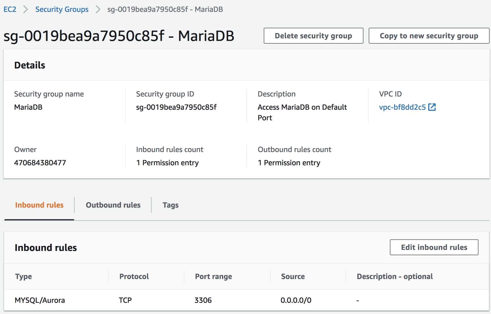

# local-yum-mariadb
Local YUM Repository and a MariaDB Cluster

In this example I will set up a local YUM repository in an AWS instance and use it to install/configure a 2-node MariaDB cluster implementing Standard Replication.

# Prepare the AWS Instance

## Launch the Instance

In the AWS console I will select the Red Hat Enterprise Linux 8 64-bit, t2.micro (Free tier eligible) instance. 

Additional Configuration:
* Under the _Add Tags_ tab with create (i.e., Add Tag) the _Name_, _MariaDB_ key/value pair.
* Under the _Configure Security Group_ tab we will add the _HTTP_ (or _HTTPS_ if configuring SSL) rule.

Once configured, we will _Launch_ the instance selecting an existing _key pair_ certificate I created earlier.

## Connect to and Set up the Instance

Once the instance is up an running (as verified in the AWS console) we are ready to now connect through an SSH-enabled terminal to your instance by running the command:

```
ssh -i /<path-to-pem>/<mycert>.pem ec2-user@ec2-xxx-xxx-xxx-xxx.compute-1.amazonaws.com
```

The Public DNS above can be obtained from the instance _Description_ (and it will change every time the instance is re-started). I will from here on generically reference it using 'xxx' for each 8-bit field.

Create and configure your user id by running the following commands (_passwd_ set optional) and log in using your user:

```
sudo su
useradd <your_user>
passwd <your_user>
mkdir /home/<your_user>/.ssh
cp /home/ec2-user/.ssh/authorized_keys /home/<your_user>/.ssh/
chown -R <your_user>.<your_user> /home/<your_user>/.ssh
```

Grant _root_ access to your user by running as root the _visudo_ command and adding the line below the _ec2-user_ line:
```
<your_user>        ALL=(ALL)       NOPASSWD: ALL
```

# Set Up NGINX/YUM

## Install/Configure NGINX

Run the following commands as root user (last to verify that is is up an running):

```
yum install nginx
systemctl start nginx
systemctl enable nginx
systemctl status nginx
```

You can now verify that it is running by typing your instance public DNS in the browser (i.e., http://ec2-xxx-xxx-xxx-xxx.compute-1.amazonaws.com/) and verifying that you get the "Welcome to nginx on Red Hat Enterprise Linux!" page (if it fails to start, the _journalctl -xe_ command, as indicated in the output can help troubleshoot the cause)

## Create the Local YUM/DNF Repository

While I have used _yum_ for this installation, as of RHEL 8 it is being replaced by the _dnf_ installer (either one can be used). Run the following commands as _root_ user to support the YUM repository creation:

```
yum install createrepo  yum-utils
mkdir -p /var/www/html/repos/mariadb
```

and edit a newly created _/etc/yum.repos.d/mariadb.repo_ file to include the following:

```
[mariadb]
name=mariadb
baseurl=file:///var/www/html/repos/mariadb
enabled=1
gpgkey=file:///etc/pki/rpm-gpg/RPM-GPG-KEY-MariaDB
gpgcheck=1
```

The _gpgcheck_ can be disabled initially but, if you want to set this up as I did, you can run the below commands as _root_:

```
cd /etc/pki/rpm-gpg
wget https://yum.mariadb.org/RPM-GPG-KEY-MariaDB
```


## Configure NGINX to Include the Repository

Edit the newly created _/etc/nginx/conf.d/repos.conf_ to include the following (this configuration should automatically be imported by the _/etc/nginx/nginx.conf_ main configuration file):

```
server {
        listen   80;
        server_name  ec2-xxx-xxx-xxx-xxx.compute-1.amazonaws.com; #change to your real domain
        root   /var/www/html/repos;
        location / {
                autoindex on;   #enable listing of directory index
        }
}
```


## Download the RPMS and Create the Repo

Run the following commands as _root_ to download the specific version 10.4.12 MariaDB (and non-MariaDB) rpms compatible with RHEL-8 (last _rm_ includes any non-rpm files). For this exercise we will only install the Server/Client RPMS and the _galera_ dependency:

```
cd /var/www/html/repos/mariadb/
yum install wget
wget -r --no-parent --no-directories --accept-regex 'MariaDB.*10.4.12.*.rpm' http://mariadb.mirror.globo.tech//mariadb-10.4.12/yum/rhel8-amd64/rpms/
wget -r --no-parent --no-directories --reject-regex 'MariaDB.*.rpm' http://mariadb.mirror.globo.tech//mariadb-10.4.12/yum/rhel8-amd64/rpms/
rm index.html
createrepo .
```

Note: If you add RPMS to the repository you can run _yum clean all_ followed _createrepo --update /var/www/html/repos/mariadb_


## Setup File Listing and Restart NGINX

Run the below commands (first one will enable the directory files listing/access):
```
restorecon -R /var/www/html/repos
service restart nginx
```

Visiting our url http://ec2-xxx-xxx-xxx-xxx.compute-1.amazonaws.com/ will now show the _mariadb_ index. Clicking on the _/mariadb_ folder will display the list of rpms as shown below.


## Test Accessing the Repo Locally

As _root_ user (or sudo) run _yum list | grep MariaDB_ to get a listing like below:

```
MariaDB-backup.x86_64                                10.4.12-1.el8                                     mariadb                         
MariaDB-backup-debuginfo.x86_64                      10.4.12-1.el8                                     mariadb                         
MariaDB-client.x86_64                                10.4.12-1.el8                                     mariadb                         
MariaDB-client-debuginfo.x86_64                      10.4.12-1.el8                                     mariadb                         
MariaDB-common.x86_64                                10.4.12-1.el8                                     mariadb                         
MariaDB-common-debuginfo.x86_64                      10.4.12-1.el8                                     mariadb                         
MariaDB-connect-engine.x86_64                        10.4.12-1.el8                                     mariadb                         
MariaDB-connect-engine-debuginfo.x86_64              10.4.12-1.el8                                     mariadb                         
MariaDB-cracklib-password-check.x86_64               10.4.12-1.el8                                     mariadb                         
MariaDB-cracklib-password-check-debuginfo.x86_64     10.4.12-1.el8                                     mariadb                         
MariaDB-devel-debuginfo.x86_64                       10.4.12-1.el8                                     mariadb                         
MariaDB-gssapi-server.x86_64                         10.4.12-1.el8                                     mariadb                         
MariaDB-gssapi-server-debuginfo.x86_64               10.4.12-1.el8                                     mariadb                         
MariaDB-rocksdb-engine.x86_64                        10.4.12-1.el8                                     mariadb                         
MariaDB-rocksdb-engine-debuginfo.x86_64              10.4.12-1.el8                                     mariadb                         
MariaDB-server-debuginfo.x86_64                      10.4.12-1.el8                                     mariadb                         
MariaDB-shared.x86_64                                10.4.12-1.el8                                     mariadb                         
MariaDB-shared-debuginfo.x86_64                      10.4.12-1.el8                                     mariadb                         
MariaDB-test-debuginfo.x86_64                        10.4.12-1.el8                                     mariadb                         
MariaDB-tokudb-engine.x86_64                         10.4.12-1.el8                                     mariadb                         
MariaDB-tokudb-engine-debuginfo.x86_64               10.4.12-1.el8                                     mariadb
```

Note that all RPMS shown in the file listing screenshot are not visible (for instance, MariaDB-server is missing). This is because RHEL 8 already comes with its own conflicting RPM distribution named using a lowercase naming convention:

```
[root@ip-xxx-xxx-xxx-xxx ~]# yum list | grep -i mariadb-server
MariaDB-server-debuginfo.x86_64                      10.4.12-1.el8                                     mariadb                         
mariadb-server.x86_64                                3:10.3.17-1.module+el8.1.0+3974+90eded84          rhel-8-appstream-rhui-rpms      
mariadb-server-galera.x86_64                         3:10.3.17-1.module+el8.1.0+3974+90eded84          rhel-8-appstream-rhui-rpms      
mariadb-server-utils.x86_64                          3:10.3.17-1.module+el8.1.0+3974+90eded84          rhel-8-appstream-rhui-rpms
```

If I temporarily disable that repo when performing the listing, the version I want install is now visible:
```
[root@ip-172-31-39-159 ~]# yum list --disablerepo=rhel-8-appstream-rhui-rpms | grep -i mariadb-server
MariaDB-server.x86_64                            10.4.12-1.el8                               mariadb                        
MariaDB-server-debuginfo.x86_64                  10.4.12-1.el8                               mariadb
```

## Test Accessing the Repo Remotely

As _root_ user, create the _/etc/yum.repos.d/mariadb.repo_ with contents below (for now, disabling _gpgcheck_ though it can easily be enabled as shown earlier) in a remote VM:
```
[mariadb]
name=mariadb
baseurl=http://ec2-xxx-xxx-xxx-xxx.compute-1.amazonaws.com/mariadb
enabled=1
gpgcheck=0
```

Assuming no access issues, the yum listing command above should produce the same output as the local run.

# MariaDB Setup

## Install the MariaDB Server/Client on the Master Instance

As _root_ user (or using _sudo_) run the following commands:
```
yum clean metadata
yum install galera-4
yum install --disablerepo=rhel-8-appstream-rhui-rpms MariaDB-server MariaDB-client
```

Once installation is complete, start the server by running _service mariadb start_ (and _service mariadb status_ to verify that it is running)

Access the database by running _mariadb -u root_ and once in, run the test command shown below:
```
[root@ip-xxx-xxx-xxx-xxx ~]# mariadb -u root
Welcome to the MariaDB monitor.  Commands end with ; or \g.
Your MariaDB connection id is 9
Server version: 10.4.12-MariaDB MariaDB Server

Copyright (c) 2000, 2018, Oracle, MariaDB Corporation Ab and others.

Type 'help;' or '\h' for help. Type '\c' to clear the current input statement.

MariaDB [(none)]> show databases;
+--------------------+
| Database           |
+--------------------+
| information_schema |
| mysql              |
| performance_schema |
| test               |
+--------------------+
4 rows in set (0.000 sec)

MariaDB [(none)]> 
```
### Secure Installation

Set Up the secure installation by running the command _mysql_secure_installation_ and entering information as shown below:
```
[root@ip-xxx-xxx-xxx-xxx ~]# mysql_secure_installation

NOTE: RUNNING ALL PARTS OF THIS SCRIPT IS RECOMMENDED FOR ALL MariaDB
      SERVERS IN PRODUCTION USE!  PLEASE READ EACH STEP CAREFULLY!

In order to log into MariaDB to secure it, we'll need the current
password for the root user. If you've just installed MariaDB, and
haven't set the root password yet, you should just press enter here.

Enter current password for root (enter for none): 
OK, successfully used password, moving on...

Setting the root password or using the unix_socket ensures that nobody
can log into the MariaDB root user without the proper authorisation.

You already have your root account protected, so you can safely answer 'n'.

Switch to unix_socket authentication [Y/n] n
 ... skipping.

You already have your root account protected, so you can safely answer 'n'.

Change the root password? [Y/n] n
 ... skipping.

By default, a MariaDB installation has an anonymous user, allowing anyone
to log into MariaDB without having to have a user account created for
them.  This is intended only for testing, and to make the installation
go a bit smoother.  You should remove them before moving into a
production environment.

Remove anonymous users? [Y/n] Y
 ... Success!

Normally, root should only be allowed to connect from 'localhost'.  This
ensures that someone cannot guess at the root password from the network.

Disallow root login remotely? [Y/n] Y
 ... Success!

By default, MariaDB comes with a database named 'test' that anyone can
access.  This is also intended only for testing, and should be removed
before moving into a production environment.

Remove test database and access to it? [Y/n] Y
 - Dropping test database...
 ... Success!
 - Removing privileges on test database...
 ... Success!

Reloading the privilege tables will ensure that all changes made so far
will take effect immediately.

Reload privilege tables now? [Y/n] Y
 ... Success!

Cleaning up...

All done!  If you've completed all of the above steps, your MariaDB
installation should now be secure.

Thanks for using MariaDB!
```

## Modify the Configuration

As _root_ user (or _sudo_) run below commands:
```
mkdir /var/log/mariadb
chown -R mysql. /var/log/mariadb
cp /etc/my.cnf.d/server.cnf  /etc/my.cnf.d/server.cnf.orig
```

Edit the _/etc/my.cnf.d/server.cnf_ file to include the below configuration and run _service mariadb restart_ after:
```
[mysqld]
server-id=1
log_bin=/var/log/mariadb/mariadb-bin.log
```

## Configure the Database

Run _mariadb -u root -p_ (enter the password set during the secure installation) and run commands as shown below:
```
[root@ip-***-***-***-*** yum.repos.d]# mysql -u root -p
Enter password: 
Welcome to the MariaDB monitor.  Commands end with ; or \g.
Your MariaDB connection id is 9
Server version: 10.4.12-MariaDB-log MariaDB Server

Copyright (c) 2000, 2018, Oracle, MariaDB Corporation Ab and others.

Type 'help;' or '\h' for help. Type '\c' to clear the current input statement.

MariaDB [(none)]> GRANT REPLICATION SLAVE ON *.* TO replication_user IDENTIFIED BY '********';
Query OK, 0 rows affected (0.001 sec)

MariaDB [(none)]> FLUSH PRIVILEGES;
Query OK, 0 rows affected (0.000 sec)

MariaDB [(none)]> FLUSH TABLES WITH READ LOCK;
Query OK, 0 rows affected (0.002 sec)

MariaDB [(none)]> SHOW MASTER STATUS;
+--------------------+----------+--------------+------------------+
| File               | Position | Binlog_Do_DB | Binlog_Ignore_DB |
+--------------------+----------+--------------+------------------+
| mariadb-bin.000001 |      647 |              |                  |
+--------------------+----------+--------------+------------------+
1 row in set (0.000 sec)

MariaDB [(none)]> UNLOCK TABLES;
Query OK, 0 rows affected (0.000 sec)

MariaDB [(none)]> 
```

and then run _service mariadb restart_

## Install the MariaDB Server/Client on a Slave Instance

Before starting the installation we will create another RHEL 8 AWS instance (same flavor) and give it the tag _Name MariaDB-Slave_. No need to assign any security groups (other than leave the default SSH access).

Once up, we will connect to the instance as _ec2-user_ (we can skip adding our user).

## Create the YUM Repository

As _root_ user we will create an _/etc/yum.repos.d/mariadb.repo_ file to include the following:

```
[mariadb]
name=mariadb
baseurl=http://ec2-xxx-xxx-xxx-xxx.compute-1.amazonaws.com/mariadb/
enabled=1
gpgkey=file:///etc/pki/rpm-gpg/RPM-GPG-KEY-MariaDB
gpgcheck=1
```

and run the below commands to add the GPG file:

```
cd /etc/pki/rpm-gpg
yum install wget
wget https://yum.mariadb.org/RPM-GPG-KEY-MariaDB
```

## Install the RPMS and Configure MariaDB

As _root_ user (or using _sudo_) run the following commands (note the modified _disablerepo_ name for this instance):
```
yum clean metadata
yum install galera-4
yum install --disablerepo=rhui-rhel-8-appstream-rhui-rpms MariaDB-server MariaDB-client
```
As before, starup the instance (_service mariadb start_), test log on to the database (_mariadb -u root_), and run the _mysql_secure_installation_ script setting the same options as in the master instance.

## Modify the Configuration

As before we will modify the configuration (but use a different value for _server-id_) and restart the service (_service mariadb restart_):
```
mkdir /var/log/mariadb
chown -R mysql. /var/log/mariadb
cp /etc/my.cnf.d/server.cnf  /etc/my.cnf.d/server.cnf.orig
```

Edit the _/etc/my.cnf.d/server.cnf_ file to include the below configuration and run _service mariadb restart_ after:
```
[mysqld]
server-id=2
log_bin=/var/log/mariadb/mariadb-bin.log
```

## Create an AWS Security Group

On the AWS Console create a custom security group named _MariaDB_ for Outbound/Inbound traffic on port 3306 (i.e., Go to  _EC2 Dashboard -> Security groups -> Create security group_ and select the built-in TCP rule _MYSQL/Aurora_ on the desired source IP range).



Once the security group has been created, attach it to the MariaDB master instance (i.e., on the Console that shows the  _Running Instances_, select the master instance and go to _Actions -> Networking -> Change Security Groups_, check the _MariaDB_ group, and click on _Assign Security Groups_)


## Configure the Slave to Connect to Master

As mentioned, we will configure the 2-node cluster to implement _Standard Replication_ from Master -> Slave.

Log on to MariaDB (_mariadb -u root -p_) on the slave and run the commands shown below.

```
MariaDB [(none)]> SHOW MASTER STATUS;
+--------------------+----------+--------------+------------------+
| File               | Position | Binlog_Do_DB | Binlog_Ignore_DB |
+--------------------+----------+--------------+------------------+
| mariadb-bin.000004 |      344 |              |                  |
+--------------------+----------+--------------+------------------+
1 row in set (0.000 sec)

MariaDB [(none)]> CHANGE MASTER TO MASTER_HOST='ec2-xxx-xxx-xxx-xxx.compute-1.amazonaws.com', MASTER_USER='replication_user', MASTER_PASSWORD='*******', MASTER_PORT=3306, MASTER_LOG_FILE='mariadb-bin.000004', MASTER_LOG_POS=344, MASTER_CONNECT_RETRY=5;
Query OK, 0 rows affected (0.006 sec)

MariaDB [(none)]> START SLAVE;
Query OK, 0 rows affected (0.001 sec)

MariaDB [(none)]> SHOW SLAVE STATUS;
+----------------------------------+-------------------------------------------+------------------+-------------+---------------+--------------------+---------------------+-----------------------------------+---------------+-----------------------+------------------+-------------------+-----------------+---------------------+--------------------+------------------------+-------------------------+-----------------------------+------------+------------+--------------+---------------------+-----------------+-----------------+----------------+---------------+--------------------+--------------------+--------------------+-----------------+-------------------+----------------+-----------------------+-------------------------------+---------------+---------------+----------------+----------------+-----------------------------+------------------+----------------+--------------------+------------+-------------+-------------------------+-----------------------------+---------------+-----------+---------------------+-----------------------------------------------------------------------------+------------------+--------------------------------+----------------------------+
| Slave_IO_State                   | Master_Host                               | Master_User      | Master_Port | Connect_Retry | Master_Log_File    | Read_Master_Log_Pos | Relay_Log_File                    | Relay_Log_Pos | Relay_Master_Log_File | Slave_IO_Running | Slave_SQL_Running | Replicate_Do_DB | Replicate_Ignore_DB | Replicate_Do_Table | Replicate_Ignore_Table | Replicate_Wild_Do_Table | Replicate_Wild_Ignore_Table | Last_Errno | Last_Error | Skip_Counter | Exec_Master_Log_Pos | Relay_Log_Space | Until_Condition | Until_Log_File | Until_Log_Pos | Master_SSL_Allowed | Master_SSL_CA_File | Master_SSL_CA_Path | Master_SSL_Cert | Master_SSL_Cipher | Master_SSL_Key | Seconds_Behind_Master | Master_SSL_Verify_Server_Cert | Last_IO_Errno | Last_IO_Error | Last_SQL_Errno | Last_SQL_Error | Replicate_Ignore_Server_Ids | Master_Server_Id | Master_SSL_Crl | Master_SSL_Crlpath | Using_Gtid | Gtid_IO_Pos | Replicate_Do_Domain_Ids | Replicate_Ignore_Domain_Ids | Parallel_Mode | SQL_Delay | SQL_Remaining_Delay | Slave_SQL_Running_State                                                     | Slave_DDL_Groups | Slave_Non_Transactional_Groups | Slave_Transactional_Groups |
+----------------------------------+-------------------------------------------+------------------+-------------+---------------+--------------------+---------------------+-----------------------------------+---------------+-----------------------+------------------+-------------------+-----------------+---------------------+--------------------+------------------------+-------------------------+-----------------------------+------------+------------+--------------+---------------------+-----------------+-----------------+----------------+---------------+--------------------+--------------------+--------------------+-----------------+-------------------+----------------+-----------------------+-------------------------------+---------------+---------------+----------------+----------------+-----------------------------+------------------+----------------+--------------------+------------+-------------+-------------------------+-----------------------------+---------------+-----------+---------------------+-----------------------------------------------------------------------------+------------------+--------------------------------+----------------------------+
| Waiting for master to send event | ec2-xxx-xxx-xxx-xxx.compute-1.amazonaws.com | replication_user |        3306 |             5 | mariadb-bin.000008 |                 652 | ip-xxx-xxx-xxx-xxx-relay-bin.000006 |           953 | mariadb-bin.000008    | Yes              | Yes               |                 |                     |                    |                        |                         |                             |          0 |            |            0 |                 652 |            1970 | None            |                |             0 | No                 |                    |                    |                 |                   |                |                     0 | No                            |             0 |               |              0 |                |                             |                1 |                |                    | No         |             |                         |                             | conservative  |         0 |                NULL | Slave has read all relay log; waiting for the slave I/O thread to update it |                8 |                              0 |                          0 |
+----------------------------------+-------------------------------------------+------------------+-------------+---------------+--------------------+---------------------+-----------------------------------+---------------+-----------------------+------------------+-------------------+-----------------+---------------------+--------------------+------------------------+-------------------------+-----------------------------+------------+------------+--------------+---------------------+-----------------+-----------------+----------------+---------------+--------------------+--------------------+--------------------+-----------------+-------------------+----------------+-----------------------+-------------------------------+---------------+---------------+----------------+----------------+-----------------------------+------------------+----------------+--------------------+------------+-------------+-------------------------+-----------------------------+---------------+-----------+---------------------+-----------------------------------------------------------------------------+------------------+--------------------------------+----------------------------+
1 row in set (0.000 sec)

MariaDB [(none)]>

```

If the slave is listening without errors, you will see the _Slave_IO_State_ set to "Waiting for master to send event" as shown above.

You can now test the replication _Master -> Slave_ by logging onto MariaDB on the Master (i.e., _mariadb -u root -p_) and running:

```
MariaDB [(none)]> SHOW DATABASES;
+--------------------+
| Database           |
+--------------------+
| information_schema |
| mysql              |
| performance_schema |
+--------------------+
3 rows in set (0.000 sec)

MariaDB [(none)]> CREATE DATABASE replication_test;
Query OK, 1 row affected (0.000 sec)

MariaDB [(none)]> SHOW DATABASES;
+--------------------+
| Database           |
+--------------------+
| information_schema |
| mysql              |
| performance_schema |
| replication_test   |
+--------------------+
4 rows in set (0.000 sec)
```

and verify that the database has been created on the slave by running on the slave:

```
MariaDB [(none)]> SHOW DATABASES;
+--------------------+
| Database           |
+--------------------+
| information_schema |
| mysql              |
| performance_schema |
| replication_test   |
+--------------------+
4 rows in set (0.000 sec)
```

Likewise, dropping the database on the Master (i.e., DROP DATABASE replication_test) will make it disappear on the slave.

## Troubleshooting

### Troubleshooting Restart

Problem: Cannot access the database when I issue command _mariadb -u root -p_ and when attempting a start or restart (i.e., _service mariadb start_) the conmmand just hangs.

Solution: Issue the command _service mariadb status_ and this might highlight the issue. A common solution might be to explicitly kill the daemon and then issue the restart:

```
[root@ip-xxx-xxx-xxx-xxx ~]# ps -ef | grep mysqld
mysql    10638     1  0 19:51 ?        00:00:00 /usr/sbin/mysqld
...
[root@ip-xxx-xxx-xxx-xxx ~]# kill -9 10638
[root@ip-xxx-xxx-xxx-xxx ~]# service mariadb restart
```

### Troubleshooting Replication

As mentioned, you can run _SHOW SLAVE STATUS_ to troubleshoot any issues with the replication. For instance, one error I got initially was: 
```
Got fatal error 1236 from master when reading data from binary log: 'log event entry exceeded max_allowed_packet; Increase max_allowed_packet on master; the first event 'mariadb-bin.000001' at 634, the last event read from 'mariadb-bin.000001' at 634, the last byte read from 'mariadb-bin.000001' at 653.'
```
This was easily resolved by modifying the configuration in /etc/my.cnf.d/server.cnf on the master and adding the _max_allowed_packet_ property as shown below:
```
# this is only for the mysqld standalone daemon
[mysqld]
server-id=1
log_bin=/var/log/mariadb/mariadb-bin.log
max_allowed_packet=32M
```
Note that a configuration change like the one above will require a daemon restart on the master (i.e., _service mariadb restart_) followed by a mariadb configuration change on the slave (i.e., _mariadb -u root -p_ followed by the sequence of SQL commands _STOP SLAVE_, _SHOW MASTER STATUS_, _CHANGE MASTER TO..._ (include the new FILE/POS values), _START SLAVE_, and _SHOW SLAVE STATUS_)


## References:

* https://mariadb.com/kb/en/rpm/
* https://mariadb.com/kb/en/yum/
* https://mariadb.com/kb/en/replication-overview/ (and https://mariadb.com/kb/en/setting-up-replication/)
